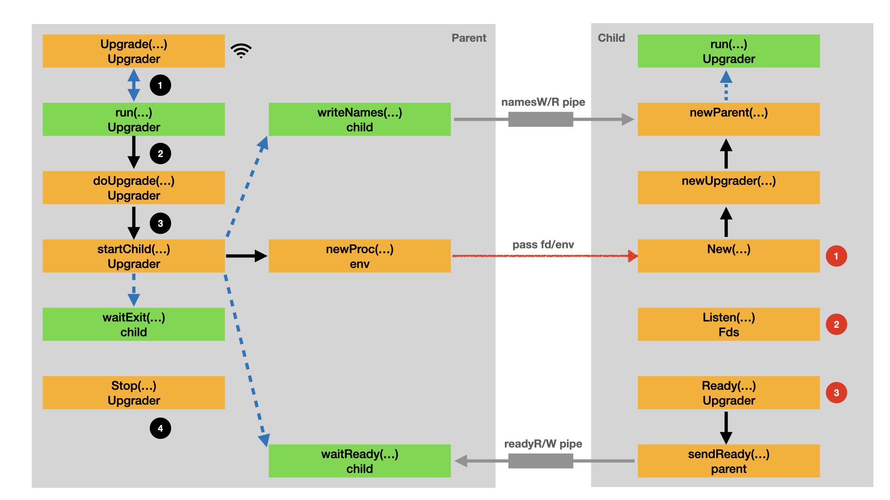

# Reference

- [Graceful shutdown of a TCP server in Go](https://eli.thegreenplace.net/2020/graceful-shutdown-of-a-tcp-server-in-go/)

## Demo steps

Run the following command to build the binary.

- `go build -o demo tcp.go`

Run the following command to start the server.

- `./demo`

Run the following command to start the client.

- `while true; do nc localhost 8080 -e echo hello; sleep 0.1; done`

The server side log is as following.

```sh
$ ./demo
[10185] 2021/11/11 23:34:59 listening on  127.0.0.1:8080
[10185] 2021/11/11 23:35:38 receive message from [127.0.0.1:43393]:[hello]
[10185] 2021/11/11 23:35:38 receive message from [127.0.0.1:42929]:[hello]
[10185] 2021/11/11 23:35:38 receive message from [127.0.0.1:33273]:[hello]
```

Run the following command to restart the server. Note that the `[PID]` should be replaced with the previous `PID`.

- `kill -s HUP [PID]`

Watch the output of server side log. You should notice that the server doesn't report any error during the restart.

```sh
[10185] 2021/11/11 23:37:00 receive message from [127.0.0.1:34589]:[hello]
[10185] 2021/11/11 23:37:00 receive message from [127.0.0.1:36367]:[hello]
[10185] 2021/11/11 23:37:00 receive from exitC channel.
[10573] 2021/11/11 23:37:00 listening on  127.0.0.1:8080
[10185] 2021/11/11 23:37:00 quit the listening.
[10185] 2021/11/11 23:37:00 stop listening.
[10185] 2021/11/11 23:37:00 finish the old process.
[10573] 2021/11/11 23:37:00 receive message from [127.0.0.1:37935]:[hello]
[10573] 2021/11/11 23:37:00 receive message from [127.0.0.1:34721]:[hello]
[10573] 2021/11/11 23:37:00 receive message from [127.0.0.1:34245]:[hello]
```

Run the following command to stop the server. Note that the `[PID]` should be replaced with the right `PID`.

- `kill -s QUIT [PID]`

Watch the output of server side log.

```sh
[10573] 2021/11/11 23:39:55 receive message from [127.0.0.1:44181]:[hello]
[10573] 2021/11/11 23:39:55 receive message from [127.0.0.1:37603]:[hello]
[10573] 2021/11/11 23:39:55 receive message from [127.0.0.1:33321]:[hello]
[10573] 2021/11/11 23:39:55 got message SIGQUIT.
[10573] 2021/11/11 23:39:55 receive from exitC channel.
[10573] 2021/11/11 23:39:55 quit the listening.
[10573] 2021/11/11 23:39:56 stop listening.
[10573] 2021/11/11 23:39:56 finish the old process.
```

## Understand tableflip design

The key design of tableflip is the parent process and child process share the same sockets. The parent process is the old version. The child process is the new one.

In the following diagram, `env.newProc()` starts the child process, passes the (listen socket) file descriptors to the child process. Thus parent and child process share the same listen socket file descriptors. Here file descriptors means more than one listen socket file descriptor can be passed to the child process.



### Start upgrade

Let's assume the tableflip based application is running and providing service to the clients. Now you upload the new application version to the target server. You can upload the new configuration for the application or continue with the old configuration.

```go
    // Do an upgrade on SIGHUP
    go func() {
        sig := make(chan os.Signal, 1)
        signal.Notify(sig, syscall.SIGHUP, syscall.SIGQUIT)
        for s := range sig {
            switch s {
            case syscall.SIGHUP:
                //log.Println("got message SIGHUP.")
                err := upg.Upgrade()                                                                                                                                 
                if err != nil {
                    log.Println("upgrade failed:", err)
                }
            case syscall.SIGQUIT:
                log.Println("got message SIGQUIT.")
                upg.Stop()
                return
            }
        }
    }()
```

- You send the signal to the old process with `kill -s HUP [PID]`.
- `Upgrader.Upgrade()` is the handler of `syscall.SIGHUP`. `Upgrader.Upgrade()` will be called upon receiving the `syscall.SIGHUP`.

```go
// Upgrade triggers an upgrade.
func (u *Upgrader) Upgrade() error {                                                                                                                                  
    response := make(chan error, 1)
    select {
    case <-u.stopC:
        return errors.New("terminating")
    case <-u.exitC:
        return errors.New("already upgraded")
    case u.upgradeC <- response:
    }

    return <-response
}
```

- `Upgrader.Upgrade()` creates a buffered `response` channel and send it to `u.upgradeC` channel.
- `Upgrader.Upgrade()` reads the message from `response` channel and blocks on the channel, once receiving the message returns.
- `Upgrader.run()` goroutine will receive the upgrade `request` from `u.upgradeC` channel.

```go
func (u *Upgrader) run() {
    defer close(u.exitC)

    var (
        parentExited <-chan struct{}
        processReady = u.readyC
    )

    if u.parent != nil {
        parentExited = u.parent.exited
    }

    for {
        select {
        case <-parentExited:
            parentExited = nil

        case <-processReady:
            processReady = nil

        case <-u.stopC:
            u.Fds.closeAndRemoveUsed()
            return

        case request := <-u.upgradeC:
            if processReady != nil {
                request <- errNotReady
                continue
            }

            if parentExited != nil {
                request <- errors.New("parent hasn't exited")
                continue
            }

            file, err := u.doUpgrade()
            request <- err

            if err == nil {
                // Save file in exitFd, so that it's only closed when the process
                // exits. This signals to the new process that the old process
                // has exited.
                u.exitFd <- neverCloseThisFile{file}
                u.Fds.closeUsed()
                return
            }
        }
    }
}
```

- After receive `request` from `u.upgradeC` channel, `processReady` and `parentExited` is checked. Both of them need to be nil.

