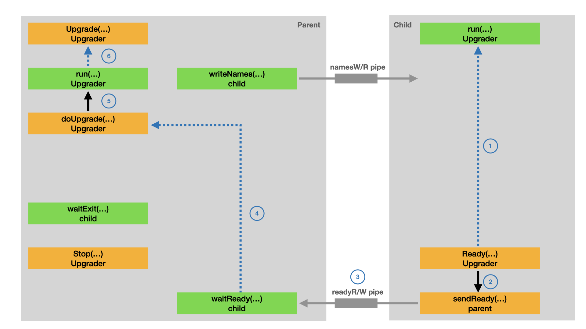

### Parent process part 3

`startChild()` calls `env.newProc()` to start the child process. And passes FD (file descriptors) and environment vars to child process. Here we share the listen sockets (sockets is also FD) via process inheritance. There is another way to share FD between different processes (process without inheritance relationship). See [here](https://github.com/ericwq/examples/tree/main/socket_dup) for detail.

- `startChild()` starts `writeName()`, `waitExit()` and `waitReady()` goroutines.
- These goroutines runs on the parent side.
- `child.writeNames()` goroutine writes to `namesW` pipe to send FD names to child.
- `child.waitExit()` goroutine waits for the child process to exit, in some case child process failed to start.
- `child.waitExit()` sends the child process return error to `child.result` channel.
- `child.waitReady()` goroutine reads from `readR` pipe to get the ready message from the child.
- `child.waitReady()` returns `namesW` to `child.ready` channel

```go
func startChild(env *env, passedFiles map[fileName]*file) (*child, error) {                                                                                            
    // These pipes are used for communication between parent and child
    // readyW is passed to the child, readyR stays with the parent
    readyR, readyW, err := os.Pipe()
    if err != nil {
        return nil, fmt.Errorf("pipe failed: %s", err)
    }

    namesR, namesW, err := os.Pipe()
    if err != nil {
        readyR.Close()
        readyW.Close()
        return nil, fmt.Errorf("pipe failed: %s", err)
    }

    // Copy passed fds and append the notification pipe
    fds := []*os.File{readyW, namesR}
    var fdNames [][]string
    for name, file := range passedFiles {
        nameSlice := make([]string, len(name))
        copy(nameSlice, name[:])
        fdNames = append(fdNames, nameSlice)
        fds = append(fds, file.File)
    }

    // Copy environment and append the notification env vars
    sentinel := fmt.Sprintf("%s=yes", sentinelEnvVar)
    var environ []string
    for _, val := range env.environ() {
        if val != sentinel {
            environ = append(environ, val)
        }
    }
    environ = append(environ, sentinel)

    proc, err := env.newProc(os.Args[0], os.Args[1:], fds, environ)
    if err != nil {
        readyR.Close()
        readyW.Close()
        namesR.Close()
        namesW.Close()
        return nil, fmt.Errorf("can't start process %s: %s", os.Args[0], err)
    }

    exited := make(chan struct{})
    result := make(chan error, 1)
    ready := make(chan *os.File, 1)

    c := &child{
        env,
        proc,
        readyR,
        namesW,
        ready,
        result,
        exited,
    }
    go c.writeNames(fdNames)
    go c.waitExit(result, exited)
    go c.waitReady(ready)
    return c, nil
}

func (c *child) waitExit(result chan<- error, exited chan<- struct{}) {
    result <- c.proc.Wait()
    close(exited)
    // Unblock waitReady and writeNames
    c.readyR.Close()
    c.namesW.Close()
}

func (c *child) waitReady(ready chan<- *os.File) {
    var b [1]byte
    if n, _ := c.readyR.Read(b[:]); n > 0 && b[0] == notifyReady {
        // We know that writeNames has exited by this point.
        // Closing the FD now signals to the child that the parent
        // has exited.
        ready <- c.namesW
    }
    c.readyR.Close()
}

func (c *child) writeNames(names [][]string) {
    enc := gob.NewEncoder(c.namesW)
    if names == nil {
        // Gob panics on nil
        _ = enc.Encode([][]string{})
        return
    }
    _ = enc.Encode(names)
}
```

- First , `startChild()` creates two pipes, that pipes are used for communication between parent and child.
- Parent sends FD names to child through pipe. Child sends ready message to parent through another pipe.
- The `readyW` and `namesR` pipes is passed to the child process. `readyR` and `namesW` stays with the parent.
- Note the `TABLEFLIP_HAS_PARENT_7DIU3` environment var, which helps to identify parent exist.
- `env.newProc()` passes the `passedFiles` to child process, which are the FD of pipes and all kinds of sockets.
- `env.newProc()` passes the `environ` to child process, these are environment variables.
- `env.newProc()` is actually the `newOSProcess()` function.
- `newOSProcess()` is just a wrapper of `syscall.StartProcess()`.

Once `env.newProc()` is called, the child process is created.

### Child process part 1

For the child process, the first thing is to create (`New()`) a `Upgrader` object first, then `Listen()`, then `Rady()`. Let's discuss them in in detail.

```go
var (
    stdEnvMu       sync.Mutex
    stdEnvUpgrader *Upgrader
)

var ErrNotSupported = errors.New("tableflip: platform does not support graceful restart")

// New creates a new Upgrader. Files are passed from the parent and may be empty.
//
// Only the first call to this function will succeed. May return ErrNotSupported.
func New(opts Options) (upg *Upgrader, err error) {
    stdEnvMu.Lock()
    defer stdEnvMu.Unlock()

    if !isSupportedOS() {
        return nil, fmt.Errorf("%w", ErrNotSupported)
    }

    if stdEnvUpgrader != nil {
        return nil, errors.New("tableflip: only a single Upgrader allowed")
    }

    upg, err = newUpgrader(stdEnv, opts)
    // Store a reference to upg in a private global variable, to prevent
    // it from being GC'ed and exitFd being closed prematurely.
    stdEnvUpgrader = upg
    return
}

func newUpgrader(env *env, opts Options) (*Upgrader, error) {
    if initialWD == "" {
        return nil, errors.New("couldn't determine initial working directory")
    }

    parent, files, err := newParent(env)
    if err != nil {
        return nil, err
    }

    if opts.UpgradeTimeout <= 0 {
        opts.UpgradeTimeout = DefaultUpgradeTimeout
    }

    u := &Upgrader{
        env:       env,
        opts:      opts,
        parent:    parent,
        parentErr: make(chan error, 1),
        readyC:    make(chan struct{}),
        stopC:     make(chan struct{}),
        upgradeC:  make(chan chan<- error),
        exitC:     make(chan struct{}),
        exitFd:    make(chan neverCloseThisFile, 1),
        Fds:       newFds(files, opts.ListenConfig),
    }

    go u.run()

    return u, nil
}
```

- `New()` is called to create a `Upgrader`.
- The wok is done by calling `newUpgrader()`. Note `stdEnvUpgrader` is a singlton object.
- `newUpgrader()` calls `newParent()` to build the parent object.
- `newUpgrader()` calls `newFds()` to build the inherited FD map.
- `newUpgrader()` builds `Upgrader` object and starts a goroutine `Upgrader.run()`.
- You has already see the `Upgrader.run()` in the [Parent process part](#parent-process-part).

```go
const (
    sentinelEnvVar = "TABLEFLIP_HAS_PARENT_7DIU3"
    notifyReady    = 42
)

type parent struct {
    wr     *os.File
    result <-chan error
    exited <-chan struct{}
}

func newParent(env *env) (*parent, map[fileName]*file, error) {
    if env.getenv(sentinelEnvVar) == "" {
        return nil, make(map[fileName]*file), nil
    }

    wr := env.newFile(3, "write")
    rd := env.newFile(4, "read")

    var names [][]string
    dec := gob.NewDecoder(rd)
    if err := dec.Decode(&names); err != nil {
        return nil, nil, fmt.Errorf("can't decode names from parent process: %s", err)
    }

    files := make(map[fileName]*file)
    for i, parts := range names {
        var key fileName
        copy(key[:], parts)

        // Start at 5 to account for stdin, etc. and write
        // and read pipes.
        fd := 5 + i
        env.closeOnExec(fd)
        files[key] = &file{
            env.newFile(uintptr(fd), key.String()),
            uintptr(fd),
        }
    }

    result := make(chan error, 1)
    exited := make(chan struct{})
    go func() {
        defer rd.Close()

        n, err := io.Copy(ioutil.Discard, rd)
        if n != 0 {
            err = errors.New("unexpected data from parent process")
        } else if err != nil {
            err = fmt.Errorf("unexpected error while waiting for parent to exit: %s", err)
        }
        result <- err
        close(exited)
    }()

    return &parent{
        wr:     wr,
        result: result,
        exited: exited,
    }, files, nil
}

func (ps *parent) sendReady() error {
    defer ps.wr.Close()
    if _, err := ps.wr.Write([]byte{notifyReady}); err != nil {
        return fmt.Errorf("can't notify parent process: %s", err)
    }
    return nil
}
```

- `newParent()` checks the `TABLEFLIP_HAS_PARENT_7DIU3` environment var to identify the parent exist.
- `env.newFile(3,...)` is called to the `readyW` pipe. FD 3 is determined by `startChild()`.
- `env.newFile(4,...)` is called to the `namesR` pipe. FD 4 is determined by `startChild()`.
- `newParent()` reads from `namesR` to get the FD names from parent process.
- `newParent()` builds FD map - `files` with FD and FD names.

`newParent()` starts a anonymous goroutine to keep reading from `namesR` pipe, until the parent process exit. When that happens, the goroutine sends `err` to `parent.result` channel and close `parent.exited` channel.

From the above code, `parent.wr` is the `readyW` pipe. `parent.sendReady()` uses `readyW` pipe to send the ready message to parent process. The ready message is just a magic number: 42.

```go
func newFds(inherited map[fileName]*file, lc *net.ListenConfig) *Fds {
    if inherited == nil {
        inherited = make(map[fileName]*file)
    }

    if lc == nil {
        lc = &net.ListenConfig{}
    }

    return &Fds{
        inherited: inherited,
        used:      make(map[fileName]*file),
        lc:        lc,
    }
}
```

- `newFds()` builds `Fds` with inherited FD map and `net.ListenConfig` parameters.
- Please note the `net.ListenConfig` parameters can be customized by `opt.ListenConfig` parameter.

### Child process part 2

The application must use `Upgrader.Listen()` to replace the usually `net.Listen()` function. `Upgrader.Listen()` will do some tricky to keep tracking the FD of listen sockets.

```go
// Listen returns a listener inherited from the parent process, or creates a new one.
func (f *Fds) Listen(network, addr string) (net.Listener, error) {
    return f.ListenWithCallback(network, addr, f.newListener)
}

// ListenWithCallback returns a listener inherited from the parent process,
// or calls the supplied callback to create a new one.
//
// This should be used in case some customization has to be applied to create the
// connection. Note that the callback must not use the underlying `Fds` object
// as it will be locked during the call.
func (f *Fds) ListenWithCallback(network, addr string, callback func(network, addr string) (net.Listener, error)) (net.Listener, error) {
    f.mu.Lock()
    defer f.mu.Unlock()

    ln, err := f.listenerLocked(network, addr)
    if err != nil {
        return nil, err
    }

    if ln != nil {
        return ln, nil
    }

    ln, err = callback(network, addr)
    if err != nil {
        return nil, fmt.Errorf("can't create new listener: %s", err)
    }

    if _, ok := ln.(Listener); !ok {
        ln.Close()
        return nil, fmt.Errorf("%T doesn't implement tableflip.Listener", ln)
    }

    err = f.addListenerLocked(network, addr, ln.(Listener))
    if err != nil {
        ln.Close()
        return nil, err
    }

    return ln, nil
}
```

- `Fds.ListenWithCallback()` returns a listener inherited from the parent process, or
- `Fds.ListenWithCallback()` calls the supplied callback to create a new one.
- `f.listenerLocked()` returns a listener inherited from the parent process.
- `callback()` is actually `f.newListener()`, which create a new listen socket.
- `f.addListenerLocked()` adds the new created listen socket to `f.used` map.

```go
func (f *Fds) listenerLocked(network, addr string) (net.Listener, error) {
    key := fileName{listenKind, network, addr}
    file := f.inherited[key]
    if file == nil {
        return nil, nil
    }

    ln, err := net.FileListener(file.File)
    if err != nil {
        return nil, fmt.Errorf("can't inherit listener %s %s: %s", network, addr, err)
    }

    delete(f.inherited, key)
    f.used[key] = file
    return ln, nil
}

func (f *Fds) addListenerLocked(network, addr string, ln Listener) error {
    if ifc, ok := ln.(unlinkOnCloser); ok {
        ifc.SetUnlinkOnClose(false)
    }

    return f.addSyscallConnLocked(listenKind, network, addr, ln)
}

func (f *Fds) addSyscallConnLocked(kind, network, addr string, conn syscall.Conn) error {
    key := fileName{kind, network, addr}
    file, err := dupConn(conn, key)
    if err != nil {
        return fmt.Errorf("can't dup %s (%s %s): %s", kind, network, addr, err)
    }

    delete(f.inherited, key)
    f.used[key] = file
    return nil
}

func dupConn(conn syscall.Conn, name fileName) (*file, error) {
    // Use SyscallConn instead of File to avoid making the original
    // fd non-blocking.
    raw, err := conn.SyscallConn()
    if err != nil {
        return nil, err
    }

    var dup *file
    var duperr error
    err = raw.Control(func(fd uintptr) {
        dup, duperr = dupFd(fd, name)
    })
    if err != nil {
        return nil, fmt.Errorf("can't access fd: %s", err)
    }
    return dup, duperr
}

func dupFd(fd uintptr, name fileName) (*file, error) {
    dupfd, _, errno := syscall.Syscall(syscall.SYS_FCNTL, fd, syscall.F_DUPFD_CLOEXEC, 0)
    if errno != 0 {
        return nil, fmt.Errorf("can't dup fd using fcntl: %s", errno)
    }

    return newFile(dupfd, name), nil
}

```

`Fds.ListenerLocked()` builds the `key` with `network`, `addr` parameters. `Fds.ListenerLocked()` tries to find `key` from `f.inherited` map. If the key does exist in `f.inherited` map, reuse it and put it in `f.used` map.

- `Fds.addSyscallConnLocked()` builds the `key` with `kind`, `network` `addr` parameters.
- `Fds.addSyscallConnLocked()` builds the `file` by calling `dupConn()`.
- `Fds.addSyscallConnLocked()` puts the `key` and `file` into `f.used` map.

`syscall.Conn` interface can provide access to the underlying file descriptor or handle. Here it provide access to system `fd`.

### Child process part 3

The application must call `Upgrader.Ready()` to notify `Upgrader.run()` goroutine that the child process is ready. It also sends the ready message to the parent process. As show in the following diagram.



```go
// Ready signals that the current process is ready to accept connections.
// It must be called to finish the upgrade.
//
// All fds which were inherited but not used are closed after the call to Ready.
func (u *Upgrader) Ready() error {
    u.readyOnce.Do(func() {
        u.Fds.closeInherited()
        close(u.readyC)
    })

    if u.opts.PIDFile != "" {
        if err := writePIDFile(u.opts.PIDFile); err != nil {
            return fmt.Errorf("tableflip: can't write PID file: %s", err)
        }
    }

    if u.parent == nil {
        return nil
    }
    return u.parent.sendReady()
}

func (ps *parent) sendReady() error {
    defer ps.wr.Close()
    if _, err := ps.wr.Write([]byte{notifyReady}); err != nil {
        return fmt.Errorf("can't notify parent process: %s", err)
    }
    return nil
}
```

In child process:

1. `u.readyOnce.Do` close all the inherited FD and close the `u.readyC` channel.
2. `parent.sendReady()` is called to send ready message to parent process.
3. `parent.sendReady()` uses `readyW` pipe to send the magic number to parent process.

```go
func (c *child) waitReady(ready chan<- *os.File) {                                                                                              
    var b [1]byte
    if n, _ := c.readyR.Read(b[:]); n > 0 && b[0] == notifyReady {
        // We know that writeNames has exited by this point.
        // Closing the FD now signals to the child that the parent
        // has exited.
        ready <- c.namesW
    }
    c.readyR.Close()
}

func (u *Upgrader) doUpgrade() (*os.File, error) {
    child, err := startChild(u.env, u.Fds.copy())
    if err != nil {
        return nil, fmt.Errorf("can't start child: %s", err)
    }

    readyTimeout := time.After(u.opts.UpgradeTimeout)
    for {
        select {
        case request := <-u.upgradeC:
            request <- errors.New("upgrade in progress")

        case err := <-child.result:
            if err == nil {
                return nil, fmt.Errorf("child %s exited", child)
            }
            return nil, fmt.Errorf("child %s exited: %s", child, err)

        case <-u.stopC:
            child.Kill()
            return nil, errors.New("terminating")

        case <-readyTimeout:
            child.Kill()
            return nil, fmt.Errorf("new child %s timed out", child)

        case file := <-child.ready:
            return file, nil
        }
    }
}

func (u *Upgrader) run() {
    defer close(u.exitC)

    var (
        parentExited <-chan struct{}
        processReady = u.readyC
    )

    if u.parent != nil {
        parentExited = u.parent.exited
    }

    for {
        select {
        case <-parentExited:
            parentExited = nil

        case <-processReady:
            processReady = nil

        case <-u.stopC:
            u.Fds.closeAndRemoveUsed()
            return

        case request := <-u.upgradeC:
            if processReady != nil {
                request <- errNotReady
                continue
            }

            if parentExited != nil {
                request <- errors.New("parent hasn't exited")
                continue
            }

            file, err := u.doUpgrade()
            request <- err

            if err == nil {
                // Save file in exitFd, so that it's only closed when the process
                // exits. This signals to the new process that the old process
                // has exited.doUpgrade
                u.exitFd <- neverCloseThisFile{file}
                u.Fds.closeUsed()
                return
            }
        }
    }
}
```

In parent process:

4. `child.waitReady()` goroutine receives the ready message and send it to `child.ready` channel.
5. `Upgrader.doUpgrade()` method receives `c.namesW` from from `child.ready` channel.
6. In `Upgrader.run()`, `Upgrader.doUpgrade()` returns the `namesW` pipe and close `u.exitC` channel.

### Child process part 4

The application calls `Upgrader.Stop()` to stop the current process, usually in defer function.

```go
// Stop prevents any more upgrades from happening, and closes
// the exit channel.
//
// If this function is called before a call to Upgrade() has
// succeeded, it is assumed that the process is being shut down
// completely. All Unix sockets known to Upgrader.Fds are then
// unlinked from the filesystem.
func (u *Upgrader) Stop() {
    u.stopOnce.Do(func() {
        // Interrupt any running Upgrade(), and
        // prevent new upgrade from happening.
        close(u.stopC)
    })
}
```

- `Upgrader.Stop()` method also results in `Upgrader.doUpgrade()` return with an error.
- `Upgrader.Stop()` method also results in `Upgrader.run()` return and close the `u.exitC` channel.

As long as your application is running, the `Upgrader.run()` goroutine keeps running. If `Upgrader.run()` goroutine stops, the Application will unblock from the `u.exitC` channel.
