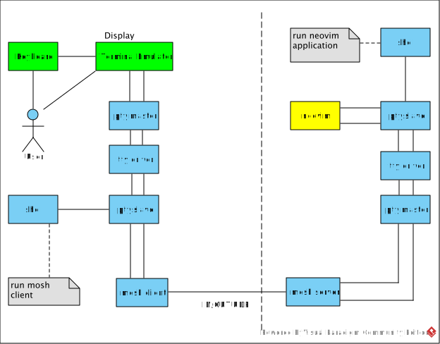

# Mosh server coding analysis



## mosh-server.cc

`mosh-server` command parameters.

```sh
Usage: mosh-server new [-s] [-v] [-i LOCALADDR] [-p PORT[:PORT2]] [-c COLORS] [-l NAME=VALUE] [-- COMMAND *]
Usage: mosh-server --help
Usage: mosh-server --version
```

- [Run the server](#run_server)
- [Serve the client](#serve)
- [How to read from client connection](#how-to-read-from-client-connection)
- [Act on terminal](#act-on-terminal)
- [How to send state to client](#how-to-send-state-to-client)

### main

```cpp
int main(int argc, char* argv[]) {
	//+--184 lines: folding ----------
	try {
		return run_server(desired_ip, desired_port, command_path, command_argv, colors, verbose, with_motd);
	} catch (const Network::NetworkException& e) {
		fprintf(stderr, "Network exception: %s\n", e.what());
		return 1;
	} catch (const Crypto::CryptoException& e) {
		fprintf(stderr, "Crypto exception: %s\n", e.what());
		return 1;
	}
}
```

In the `main` function: `run_server` is the core to start `mosh` server.

- `main()` calls `Crypto::disable_dumping_core()` to make sure we don't dump core.
- `main()` parses command parameters
- `main()` checks port range.
- `main()` prepares shell name and shell command arguments.
- `main()` makes sure UTF8 locale is set.
- `main()` calls [`run_server()`](#run_server) with the ip, port and shell path, shell arguments,(etc.) as parameters.

### run_server

- `run_server()` gets network idle timeout.
- `run_server()` gets network signaled idle timeout.
- `run_server()` gets initial window size. They will be overwritten by client on first connection.
- `run_server()` calls [`Terminal::Complete()`](client.md#terminalcomplete) to open parser and terminal.
- `run_server()` creates blank [`Network::UserStream`](client.md#networkuserstream) for newtork.
- `run_server()` initializes network, which is [`ServerConnection`](#serverconnection).
- `run_server()` sets the `verbose` mode via `network->set_verbose()`.
- `run_server()` sets the `verbose` mode via `Select::set_verbose()`.
- `run_server()` calls `network->port()` to [get the port string](#how-to-get-port-string) representation.
- `run_server()` calls `network->get_key()` to [get the session key string](#how-to-get-session-key-string) representation.
- `run_server()` prints port and session key to the standard output. The output starts with "MOSH CONNECT ".
- `run_server()` ignores signal `SIGHUP`, `SIGPIPE`.
- `run_server()` calls `fork()` to detach from terminal.
  - Parent process prints the license information and exits.
  - Child process continues.
- `run_server()` redirects `STDIN_FILENO`, `STDOUT_FILENO`, `STDERR_FILENO` to `"/dev/null"` for non-verbose mode.
- `run_server()` calls [`forkpty()`](#forkpty) to create a new process operating in a pseudo terminal.

#### forkpty

- The child process, which will run a shell process:
  - Re-enable signals `SIGHUP`, `SIGPIPE` with default value.
  - Close server-related socket file descriptors, via calling `delete`.
  - Set terminal [UTF8 support](#how-to-set-the-terminal-utf8-support).
  - Set "TERM" environment variable to be "xterm" or "xterm-256color" based on "-c color" option.
  - Set `"NCURSES_NO_UTF8_ACS"` environment variable
    - to ask ncurses to send UTF-8 instead of ISO 2022 for line-drawing chars.
  - Clear `"STY"` environment variable so GNU screen regards us as top level.
  - Change to the home directory, via calling [`chdir_homedir()`](#chdir_homedir):
  - If `.hushlogin` file don't exist and `with_motd` is true,
    - print the motd from `"/run/motd.dynamic"`,
    - or print the motd from `"/var/run/motd.dynamic"` and `"/etc/motd"`.
    - Print warning message if there is unattached mosh session, via calling [`warn_unattached()`](#warn_unattached).
    - See the following parent process to understand mosh session.
  - Wait for parent to release us, via calling `fgets()` for `stdin`.
  - Enable core dump, via calling `Crypto::reenable_dumping_core()`.
  - Execute the shell command with arguments, via calling `execvp()`.
  - If error happens during `execvp()`, Terminate the child process, via calling `exit()`.
- The parent process, which will run the mosh server process:
  - Add utmp record via calling [`utempter_add_record()`](https://www.unix.com/man-page/suse/8/utempter),
    - with `master` as pty master parameter, `"mosh [%ld]"` as host name parameter.
    - as login service update utmp record is required.
  - Serve the client, via calling [`serve()`](#serve).
    - with `master`, `terminal`, `network` as parameters.
  - Delete utmp record via calling [`utempter_remove_record()`](https://www.unix.com/man-page/suse/8/utempter),
    - with `master` as pty master parameter.
    - as login service update utmp record is required.
  - Close the master pseudo-terminal.
  - Close server-related socket file descriptors, via calling `delete`.
  - Print exiting message.

#### `ServerConnection`

- `ServerConnection` aka `Network::Transport<Terminal::Complete, Network::UserStream>`.
- `Network::Transport` is constructed with:
  - the `terminal` which is type of `Terminal::Complete`,
  - the `blank` which is type of `UserStream`,
  - `ip`, `port` as parameters.
- `Network::Transport` has a `Connection`, which represents the underlying, encrypted network connection.
- `Network::Transport` has a `TransportSender<Terminal::Complete>`, which represents the sender.
- `Network::Transport` has a `list<TimestampedState<Network::UserStream>>`, which represents receiver.
- `Network::Transport` calls `connection(desired_ip, desired_port)` to [initialize the connection](#how-to-initialize-connection).
- `Network::Transport` calls `sender(connection, initial_state)` to [initialize sender](#how-to-initialize-sender).
- In the constructor of `Network::Transport`,
  - `received_states` is a list type of `TimestampedState<Network::UserStream>`.
  - `received_states` is initialized with the `blank`as parameter.
  - `received_states` adds the `blank` to its list.
- `Network::Transport()` set `receiver_quench_timer` to zero.
- `Network::Transport()` set `last_receiver_state` to be `terminal`.
- `Network::Transport()` creates `fragments`, which is type of `FragmentAssembly`.

#### How to initialize connection

- `connection(desired_ip, desired_port)` is called to create the connection with server.
- `connection()` is the constructor of `Network::Connection`
- `connection()` initializes a empty deque of `Socket`: `socks`.
<!-- Concurrent UDP Server at Unix Network Programming: The Socket Networking API? P612 -->
- `connection()` initializes `has_remote_addr` to true.
- `connection()` initializes the `key`, which is type of `Base64Key`
  - `Base64Key` reads 16 bytes from `/dev/urandom` as the `key`.
- `connection()` initializes `session` with `key` as parameter,
  - `session` object is used to encrypt/decrypt message.
- `connection()` calls `setup()` to set the `last_port_choice` to current time.
- `connection()` calls `parse_portrange()` to parse port range from `desired_port` parameter.
- `connection()` calls [`try_bind()`](#try_bind) to bind the port to network interface.
  - If `desired_ip` is given, use `desired_ip` as parameter to call `try_bind()`.
  - `try_bind()` is called with port range parameters.
- `connection()` returns if `try_bind()` returns true.

#### How to initialize sender

- `sender(connection, initial_state)` is called to initialize the sender.
- `sender()` is the constructor of `TransportSender<Terminal::Complete>`.
- `sender()` initializes `connection` pointer with the `connection` as parameter.
- `sender()` initializes `current_state` with the `initial_state` as parameter.
- `sender()` initializes `sent_states` list with the `initial_state` as the first state.

#### try_bind

- `try_bind()` initializes a `AddrInfo` object with `desired_ip` as parameter.
  - `AddrInfo` calls `getaddrinfo()` to get the `addrinfo` object.
- `try_bind()` creates a `Socket` and pushes it into `socks` deque.
  - `Socket` uses `setsockopt()` to set socket options: `IP_MTU_DISCOVER`, `IP_TOS`, `IP_RECVTOS`.
- `try_bind()` searches the port range, calls `bind()` bind the server socket to that port.
  - If `bind()` returns successfully. `try_bind()` calls `set_MTU()` to set the MTU and return true.
  - If `bind()` fails, `try_bind()` throw exceptions and return false.

#### How to get port string

- `network->port()` calls `connection.port()` to get the port.
- `connection.port()` calls `getsockname()` to get the `sockaddr` of server socket.
- `connection.port()` calls `getnameinfo()` to get the port string representation.

#### How to get session key string

- `network->get_key()` calls `connection.get_key()` to get the session key.
- `connection.get_key()` calls `key.printable_key()` instead.
- `key.printable_key()` aka `Base64Key::printable_key()`.
- `key.printable_key()` calls `base64_encode()` to show the `key` base64 representation.

#### How to set the terminal UTF8 support

- Get the `termios` struct for `STDIN_FILENO`, via calling `tcgetattr()`.
- Set `IUTF8` flag for `termios`.
- Set the `termios` struct for `STDIN_FILENO`, via calling `tcsetattr()`.

#### chdir_homedir

- Call `getenv()` or `getpwuid(getuid())` to get the `home` path.
- Call `chdir()` to change to the `home` path.
- Call `setenv()` to set the `"PWD"` environment variable.

#### warn_unattached

- `warn_unattached()` calls `getpwuid(getuid())` to get the current user.
- `warn_unattached()` checks the records in `utmp` file
  - If the `ut_user` field is the same user as the current user, via calling `getpwuid(getuid()`,
  - If the `ut_type` field is `USER_PROCESS`,
  - If the `ut_host` field does look like `"mosh [%ld]"`, where `%ld` is the process ID,
  - If the `ut_host` field isn't equal to `ignore_entry`, which is the mosh session,
  - If pseudo-terminal device identified by the `ut_line` field exist,
  - Pushes the `ut_host` into `unattached_mosh_servers` vector.
- `warn_unattached()` returns if `unattached_mosh_servers` vector is empty.
- `warn_unattached()` prints warning message to `STDOUT`, if there exists unattached sessions.

#### serve

- `serve()` initializes the singleton `Select` object: `sel`.
- `serve()` [registers signal handler](client.md#how-to-register-signal-handler) in `sel`, for `SIGTERM`, `SIGINT`, `SIGUSR1`.
- `serve()` gets the latest remote state number, via calling `network.get_remote_state_num()`.
- `serve()` sets `child_released` to false.
- `serve()` sets `connected_utmp` to false, initializes `saved_addr` and `saved_addr_len` to zero and false.

In the main loop(while loop), It performs the following steps:

- Calculate `timeout` based on `network.wait_time()` and `terminal.wait_time()`.
- Clear file descriptor, via calling `sel.clear_fds()`.
- Get network socket, via calling `network->fds()`, `fd_list.back()`.
- Add network socket to `Select` object.
- Add pty master to `Select` object.
- Wait for socket input, signal, pty master input via calling `sel.select()`, with the `timeout` as parameter.
- Upon receive signals, the corresponding item in `Select.got_signal` array is set.
- Upon network sockets is ready to read, read it with [`network.recv()`](client.md#how-to-receive-network-input).
  - After `network.recv()`, the remote state is saved in `received_states`,
  - and the opposite direction `ack_num` is saved.
  - if remote state number is not equal to `last_remote_num`, [prepare input for terminal](#how-to-prepare-input-for-terminal).
- Upon pty master input is ready to read, read it via calling `read()` system call.
  - If it does read some input, call [string version of `terminal.act()`](#terminalactstring) to process the input data.
  - append the return value of `terminal.act()` to `terminal_to_host`.
  - set current state via calling `network.set_current_state()` with the `terminal` as parameter.
- Write user input and terminal write back to the host via calling `swrite()`.
  - All data collected in `terminal_to_host` is write to the pty master.
  - Why terminal write back? See [Terminal write back](#terminal-write-back)
- If server doesn't receive client data over `network_timeout_ms`, set `idle_shutdown` true.
- Upon receive `SIGUSR1` signal, check `network_signaled_timeout_ms` to decide how to set `idle_shutdown`.
  - `SIGUSR1` signal is used to kill the mosh-server gracefully.
- If `idle_shutdown` is true or receive any signal, prepare to shutdown.
- Quit if our shutdown has been acknowledged.
- Quit after shutdown acknowledgement timeout.
- Quit if we received and acknowledged a shutdown request.
- Update utmp if has been more than 30 seconds since heard from client.
- Check the echo condition and decide whether to echo ack via calling `terminal.set_echo_ack()`.
  - `terminal.set_echo_ack()` aka `Complete::set_echo_ack()`
  - `terminal.set_echo_ack()` checks `input_history` time against `now` and `ECHO_TIMEOUT`.
  - `terminal.set_echo_ack()` updates `input_history` and `echo_ack`.
  - If `terminal.set_echo_ack()` returns true,
  - set current state via calling `network.set_current_state()` with the `terminal` as parameter.
- Quit if there is no connection within 60 seconds.
- Perform [`network->tick()`](client.md#how-does-the-network-tick) to synchronizes the data to the client.

#### How to prepare input for terminal

- Update `last_remote_num` with the latest one.
- Initialize a empty `UserStream` object: `us`.
- Find the difference between new state and `last_receiver_state`, via calling [`network.get_remote_diff()`](#get_remote_diff).
- Initialize the `UserStream` from the above difference string via calling [`apply_string()`](#apply_string).
- Iterate through the above `us`,
  - get the `action` object of type `Parser::Action` via calling `us.get_action()`.
  - `UserEvent` object contains `Parser::UserByte` object or `Parser::Resize` object.
  - `Parser::UserByte` and `Parser::Resize` are sub-class of `Parser::Action`.
  - For `Resize` action:
    - skip the consecutive Resize action,
    - convert the action into `Parser::Resize`,
    - get the window size for `STDIN_FILENO` , via `ioctl()` and `TIOCGWINSZ` flag,
    - set the window size for `STDIN_FILENO` , via `ioctl()` and `TIOCSWINSZ` flag.
  - For other action:
    - call [`Action` version of `terminal.act()`](#terminalact) to get the transcript character.
    - append the transcript character to `terminal_to_host`.
- If `us` is not empty,
  - register input frame number for future echo ack via calling `terminal.register_input_frame()`.
- Set the current state via calling `network.set_current_state()`, if `network` is not shutdown.
- If `connected_utmp` is false and `saved_addr_len` is different from `network.get_remote_addr_len()`,
  - delete `utmp` record via calling [`utempter_remove_record()`](https://www.unix.com/man-page/suse/8/utempter), with pty master as parameter.
  - store the value from `network.get_remote_addr()` into `saved_addr_len`,
  - store the value from `network.get_remote_addr_len()` into `saved_addr_len`,
  - get the `host` name via calling `getnameinfo()`,
  - add `utmp` record via calling [`utempter_add_record`](https://www.unix.com/man-page/suse/8/utempter), with pty master and `host` as parameters.
  - set `connected_utmp` to true.
- If `child_released` is false, release the child process via writing `\n` to pty master,
  - upon receive the empty line input, the child process will start the shell.
  - set `child_released` to true.

#### get_remote_diff

- `get_remote_diff()` aka `Transport<MyState, RemoteState>::get_remote_diff()`.
- Here `RemoteState` is `UserStream`.
- `get_remote_diff()` calls `diff_from()` to [calculate diff](client.md#how-to-calculate-the-diff-for-userstream).
  - `diff_from()` to compare the newest `received_states` with `last_receiver_state` .
  - `diff_from()` returns the difference string representation of the `ClientBuffers::UserMessage` object.
- Next `get_remote_diff()` rationalizes `received_states`.
  - `get_remote_diff()` sets the `oldest_receiver_state` with the value of the oldest `received_states`.
  - `get_remote_diff()` iterates through the `received_states` list in reverse order (newest to oldest).
  - `oldest_receiver_state` is the target to be evluated for each iteration.
  - For each iterating state, calls `UserStream::subtract()` to subtract shared `UserEvent`.
  - `get_remote_diff()` stores the newest `received_states` in `last_receiver_state`.
- `get_remote_diff()` returns the difference string representation of `ClientBuffers::UserMessage`.

#### apply_string

For `UserStream`:

- `apply_string()` aka `UserStream::apply_string()`.
- `apply_string()` creates a `ClientBuffers::UserMessage` object.
- `apply_string()` parses string representation of `ClientBuffers::UserMessage`.
- `apply_string()` iterates through `ClientBuffers::UserMessage` object.
- For each iteration, `apply_string()` builds and pushes `UserEvent` into `UserStream.actions`.
  - `apply_string()` extracts `UserByte` or `Resize` from `ClientBuffers::UserMessage`.
  - `apply_string()` wraps `UserByte` or `Resize` in `UserEvent`.
- That means `apply_string()` initializes `UserStream` with `ClientBuffers::UserMessage`.

For `Complete`:

- `apply_string()` aka `Complete::apply_string`.
- `apply_string()` creates a `HostBuffers::HostMessage` object.
- `apply_string()` parses string representation of `HostBuffers::HostMessage`.
- `apply_string()` iterates through `HostBuffers::HostMessage` object.
- For each iteration, `apply_string()` checks the instruction extension:
  - If the extension is `HostBytes`, `apply_string()` calls [string version of `act()`](#terminalactstring) to change the terminal.
  - if the extension is `ResizeMessage`, `apply_string()` calls [`Action` version of `act()`](#terminalact) to change the terminal.
  - if the extension is `EchoAck`, `apply_string()` extracts `echo_ack_num` and set it in `echo_ack` field.

#### terminal.act

- `terminal.act()` aka `Complete::act()`.
- `terminal.act()` has a `Action` as parameter.
- `terminal.act()` apply action to terminal via calling `act->act_on_terminal()` with the `terminal` as parameter.
  - For `UserByte` action, [`UserByte::act_on_terminal`](#userbyteact_on_terminal) will store the transcript character to `dispatch.terminal_to_host`.
  - For `Resize` action, [`Resize::act_on_terminal`](#resizeact_on_terminal) will change the terminal frame buffer size.
- `terminal.act()` returns `terminal.read_octets_to_host()`.
  - `terminal.read_octets_to_host()` aka `Emulator::read_octets_to_host()`.
  - `terminal.read_octets_to_host()` reads `dispatch.terminal_to_host` to `ret`.
  - `terminal.read_octets_to_host()` clears `dispatch.terminal_to_host`.
  - `terminal.read_octets_to_host()` returns `ret`.
- The above implementation means `terminal.act()` return the transcript character to caller.

#### UserByte::act_on_terminal

- `act_on_terminal()` has parameter `Terminal::Emulator* emu`.
- `act_on_terminal()` calls `emu->user.input()` to convert user's cursor control sequence to ANSI cursor control sequence.
  - `emu->user.input()` has `UserByte` parameter and `application_mode_cursor_keys` parameter.
  - `emu->user.input()` checks the `UserByte` parameter.
  - For `Ground` character, `emu->user.input()` returns the raw character string.
  - For "0x1b" character, `emu->user.input()` sets state to `ESC` and returns raw character string.
  - If state is `ESC` and character is `O`,
    - `emu->user.input()` sets state to `SS3` and return empty string.
  - If state is `ESC` and character isn't `O`,
    - `emu->user.input()` sets state to `Ground` and return raw character string.
  - If state is `SS3` and character isn't `A-D` and `application_mode_cursor_keys` is false,
    - `emu->user.input()` sets state to `Ground` and return `ESC [ [A-D]` string.
  - If state is `SS3` and character isn't `A-D` and `application_mode_cursor_keys` is true,
    - `emu->user.input()` sets state to `Ground` and return `ESC O [A-D]` string.
  - See [PC-Style Function Keys](https://invisible-island.net/xterm/ctlseqs/ctlseqs.html#h3-PC-Style-Function-Keys) for application cursor mode.
- `act_on_terminal()` appends the above string to terminal `dispatch.terminal_to_host`.
  - via calling `emu->dispatch.terminal_to_host.append()` to
- `act_on_terminal()` returns void.

#### Resize::act_on_terminal

- `act_on_terminal()` has parameter `Terminal::Emulator* emu`.
- `act_on_terminal()` calls `emu->resize()` to adjust terminal frame buffer size.
  - `emu->resize()` aka `Emulator::resize()`.
  - `emu->resize()` has `s_width` and `s_height` parameter.
  - `emu->resize()` calls `fb.resize()` to finish the job.
  - `fb.resize()` aka `Framebuffer::resize()`.
  - `fb.resize()` has `s_width` and `s_height` as parameters.
  - `fb.resize()` adjust `Framebuffer.ds` size according to the width and height parameters.
  - `fb.resize()` adjust `Framebuffer.row` size according to the width and height parameters.
  - The above implementation means the `Framebuffer.ds` and `Framebuffer.row` is changed according to the parameters.
- `act_on_terminal()` returns void.

#### terminal.act(string)

- `terminal.act(string)` aka `Complete::act(string)`.
- `terminal.act(string)` has a string as parameter.
- Iterate the string parameter,
- For each character, call `parser.input()` to [parse octet into up to three actions](#parse-unicode-character-to-action).
  - Iterate the `actions`, for each action,
  - [apply action to terminal](#act-on-terminal) via calling `act->act_on_terminal()` with the `terminal` as parameter.
- Clear the `actions` via calling `actions.clear()`.
- Return `terminal.read_octets_to_host()`.
  - `read_octets_to_host()` aka `Emulator::read_octets_to_host`.
  - `read_octets_to_host()` stores the value of `dispatch.terminal_to_host`.
  - `read_octets_to_host()` clears the value of `dispatch.terminal_to_host`.
  - `read_octets_to_host()` returns the stored value of `dispatch.terminal_to_host`.

There are a lot of `Action`. Their `act->act_on_terminal()` is different form each other. The following is some examples.

- [UserByte::act_on_terminal](#userbyteact_on_terminal)
- [Resize::act_on_terminal](#resizeact_on_terminal)
- [Print::act_on_terminal](#printact_on_terminal)
- [CSI_Dispatch::act_on_terminal](#csi_dispatchact_on_terminal)

#### Parse unicode character to action

- The first `parser.input()` is actually `Parser::UTF8Parser::input()`.
- If ASCII code of character is less than "0x7f" and `buf_len` is 0,
  - call the [second `parser.input()`](#parse-wide-character-according-to-transition) with the `actions` as parameter.
  - `actions` aka `Complete.actions`, a vector of type `Parser::Action`
  - return early.
- Assign the `c` to `buf[buf_len++]`.
- Parse the `buf` fields of `Parser::UTF8Parser` in a loop.
  - According to Unicode 6.0, section 3.9 [Best Practices for using U+FFFD](https://www.unicode.org/versions/Unicode6.0.0/ch03.pdf).
  - Convert multi-byte sequence to wide character via calling `mbrtowc()`.
  - Call the [second `parser.input()`](#parse-wide-character-according-to-transition) for the wide character with the `actions` as parameter.
  - Continue the loop until all byte is parsed.


#### Parse wide character according to `Transition`

- The second `parser.input()` is actually `Parser::Parser::input()`.
- `parser.input()` calls `state->input()` to [parse the wide character to `Transition`](#parse-wide-character-to-transition).
- `parser.input()` calls `append_or_delete()` if `tx.next_state` is not NULL.
- `append_or_delete()` decides whether to push the `Action`:`state->exit()` into `actions`.
- `parser.input()` calls `append_or_delete()` to push the `Action`:`tx.action` into `actions`.
- `parser.input()` clears `tx.action`.
- `parser.input()` calls `append_or_delete()` if `tx.next_state` is not NULL.
- `append_or_delete()` decides whether to push the `Action`:`tx.next_state->enter()` into `actions`.
- `parser.input()` updates `state` with `tx.next_state`.


#### Parse wide character to `Transition`

- `state->input()` parses the character into `Transition` via calling [`anywhere_rule()`](#anywhere-rule).
  - `anywhere_rule()` creates `Transition` based on character coding rule.
- If the created `Transition.next_state` is not empty,
  - `state->input()` assigns value to `char_present` and `ch` fields of `Transition.action`.
  - returns early with created `Transition`.
- `state->input()` parses the character into `Transition` via calling `this->input_state_rule()`.
  - `this->input_state_rule()` parses high Unicode code-points.
  - The behaviour of `this->input_state_rule()` depends on the implementation of `State` sub-class.
  - The default `State` is `Paser:Ground`.
  - `Ground::input_state_rule()` parses character according to [`C0_prime` rule](#c0_prime-rule) and [`GLGR` rule](#glgr-rule).
  - `C0_prime` rule returns a `Transition` whose `action` field is `Parser::Execute`.
  - `GLGR` rule returns a `Transition` whose `action` field is `Parser::Print`.
  - `Ground::input_state_rule()` returns the second `Transition` whose `action` field is `Parser::Ignore`.
- `state->input()` assigns value to `char_present` and `ch` fields of the second `Transition.action`.
- Return with the second created `Transition`.

#### anywhere rule

- Action = Execute; State = Ground - "0x18, 0x1A, 0x80…8F, 0x91…97, 0x99, 0x9A"
- Action = Ignore; State = Ground - "0x9C"
- Action = Ignore; State = Escape - "0x1B"
- Action = Ignore; State = SOS_PM_APC_String - "0x98, 0x9E, 0x9F"
- Action = Ignore; State = DCS_Entry - "0x90"
- Action = Ignore; State = OSC_String - "0x9D"
- Action = Ignore; State = CSI_Entry - "0x9B"
- See [List of Unicode characters](https://en.wikipedia.org/wiki/List_of_Unicode_characters)
- See [ANSI escape code in wikipedia](https://en.wikipedia.org/wiki/ANSI_escape_code)
- See [C0 and C1 control codes](https://en.wikipedia.org/wiki/C0_and_C1_control_codes#Basic_ASCII_control_codes)

#### C0_prime rule

- Action = Ignore; State = Execute — "0x19, 0x00…17, 0x1C…1F"
- See [XTerm Control Sequences](https://invisible-island.net/xterm/ctlseqs/ctlseqs.html)

#### GLGR rule

- Action = Ignore; State = Print — "0x20…0x7F, 0xA0…FF",
- See [XTerm Control Sequences](https://invisible-island.net/xterm/ctlseqs/ctlseqs.html)

### How to read from client connection

Upon server network socket is ready to read, `connection->recv()` starts to read it.

#### `Crypto::Message` -> `Network::Packet` -> `Network::Fragment`

- [`Connection::recv_one()`](client.md#how-to-receive-datagram-from-socket) reads UDP datagram from server socket.
- [`Connection::recv_one()`](client.md#how-to-receive-datagram-from-socket) decrypts the UDP datagram into `Crypto::Message`.
- `Crypto::Message` is a utility class for crypto.
- `Crypto::Message` contains the following fields:
  - `Nonce`: contains `direction` and `seq` fields in `Network::Packet`.
  - `text`: contains `timestamp`, `timestamp_reply` and `payload` fields in `Network::Packet`.
- [`Connection::recv_one()`](client.md#how-to-receive-datagram-from-socket) transforms `Crypto::Message` into `Network::Packet`.
- `Network::Packet` belongs to in [datagram layter](ref.md#datagram-layer).
- `Network::Packet` contains the following fields:
  - `seq`,
  - `timestamp`,
  - `timestamp_reply`,
  - `payload`,
  - `direction`.
- [`Connection::recv_one()`](client.md#how-to-receive-datagram-from-socket) returns string representation of `Network::Packet` paylod field.
- [`Connection::recv()`](client.md#how-to-read-data-from-socket) returns string representation of `Network::Packet` payload field.
- [`Fragment()`](client.md#how-to-create-the-frament-from-string) transform `Network::Packet` into `Network::Fragment`
- `Network::Fragment` contains the following fields:
  - `id`,
  - `fragment_num`,
  - `final`,
  - `contents`.

#### `Network::Fragment` -> `TransportBuffers.Instruction` -> `Network::UserStream`

- [`fragments.get_assembly()`](client.md#how-to-build-instruction-from-fragments) aka `FragmentAssembly::get_assembly()`.
- [`fragments.get_assembly()`](client.md#how-to-build-instruction-from-fragments) concatenates the `contents` field of each `Network::Fragment` into one string.
- [`fragments.get_assembly()`](client.md#how-to-build-instruction-from-fragments) decompress the string and transforms it into `TransportBuffers.Instruction`.
- `TransportBuffers.Instruction` is the "state" in [transport layter](ref.md#transport-layer).
- `TransportBuffers.Instruction` contains the following fields:
  - `old_num`,
  - `new_num`,
  - `ack_num`,
  - `throwaway_num`,
  - `diff`.
- [`connection->recv()`](client.md#how-to-receive-network-input) creates an empty `TimestampedState<Network::UserStream>`.
- `Network::UserStream` is wrapped in `TimestampedState<Network::UserStream>`.
- `TimestampedState<Network::UserStream>` contains the following fields:
  - `timestamp`,
  - `num`,
  - `state`.

#### `Parser::UserByte` -> `Network::UserEvent` -> `Network::UserStream`

- [`network.get_remote_diff()`](#get_remote_diff) compares the newest `Network::UserStream` and existing `Network::UserStream`.
- [`network.get_remote_diff()`](#get_remote_diff) returns the difference string representation of `ClientBuffers::UserMessage`.
- [`UserStream.apply_string()`](#apply_string) initializes `UserStream` with `ClientBuffers::UserMessage`.
- `Network::UserStream` contains a deque of type `Network::UserEvent`.
- `Network::UserEvent` contains the following fields:
  - `type`,
  - `userbyte`,
  - `resize`.
- [`connection->recv()`](client.md#how-to-receive-network-input) stores `TimestampedState<Network::UserStream>` in `received_states`.

### Act on terminal

The `act_on_terminal()` method for all kinds of `Action` is different. To understand the design, first you need to understand how to register function. Then we will give you several solid examples to see the effect of `act_on_terminal()`.

#### How to register function

- There is a singleton `DispatchRegistry`, which is a global dispatch registry.
- `DispatchRegistry` contains three map, which is type of `map<std::string, Function>`.
- `DispatchRegistry` has `escape` map, `CSI` map, `control` map.
- `get_global_dispatch_registry()` aka `Terminal::get_global_dispatch_registry`.
- `get_global_dispatch_registry()` returns the `DispatchRegistry` singleton object.
- The constructor of `Function` class insert a pair of `string,Function` into the specified map type.
- There are a lot of `Function` instances registered in `DispatchRegistry`.

See the following example to get a solid understanding. The last parameter of `Function` constructor is a function. It has a `Framebuffer` parameter and a `Dispatcher` parameter and returns void.

```cpp
static Function func_CSI_EL(CSI, "K", CSI_EL);
static Function func_CSI_ED(CSI, "J", CSI_ED);
static Function func_CSI_cursormove_A(CSI, "A", CSI_cursormove);
static Function func_CSI_cursormove_B(CSI, "B", CSI_cursormove);
static Function func_CSI_cursormove_C(CSI, "C", CSI_cursormove);
static Function func_CSI_cursormove_D(CSI, "D", CSI_cursormove);
static Function func_CSI_DSR(CSI, "n", CSI_DSR);
…
static Function func_Ctrl_BEL(CONTROL, "\x07", Ctrl_BEL);
static Function func_Ctrl_LF(CONTROL, "\x0a", Ctrl_LF);
…
static Function func_Esc_DECSC(ESCAPE, "7", Esc_DECSC);
static Function func_Esc_DECRC(ESCAPE, "8", Esc_DECRC);
…
```

#### Print::act_on_terminal

- `act_on_terminal()` calls `emu->print()` to do the job, with current action as parameter.
- `emu->print()` aka `Emulator::print()`.
- Check for printing ISO 8859-1 first, to get the character width.
- Get the cursor position cell from frame buffer: `this_cell`.
- Check the character width:
- In case of normal character or wide character:
  - If it's wrap mode or should wrap,
    - set the cursor row wrap;
    - move to column 0 in `fb.ds`;
    - scroll the row by one;
    - `this_cell` is NULL.
  - If wrap mode is true, character width is two, cursor column reaches the screen width.
    - reset the `this_cell`;
    - set the cursor row wrap;
    - move to column 0 in `fb.ds`;
    - scroll the row by one;
    - `this_cell` is NULL.
  - If it's insert mode in `fb.ds`,
    - insert cell according to the character width;
    - `this_cell` is NULL.
  - Get the cursor position cell from frame buffer: `this_cell`. If `this_cell` is NULL.
  - Reset the `this_cell`;
  - Append the character;
  - Set cell wide;
  - Apply rendition to cell.
  - If it's wide character, erase overlapped cell.
  - Move cursor to next position in `fb.ds`.
- In case of combining character:
  - Get the combining cell from frame buffer: `combining_cell`.
  - If cell starts with combining character,
    - set cell fall back;
    - move cursor to next position in `fb.ds`.
  - If cell is not full (32 is the limit by mosh),
    - append the character to `combining_cell`.
- For other case, just ignore it.

#### CSI_Dispatch::act_on_terminal

- `act_on_terminal()` calls `emu->CSI_dispatch()` to do the job, with current action as parameter.
- `emu->CSI_dispatch()` aka `Emulator::CSI_dispatch()`.
- `CSI_dispatch()` calls `dispatch.dispatch()` to do the job, with `CSI`, action and `Framebuffer` as parameter.
- `dispatch.dispatch()` aka `Dispatcher::dispatch()`.
- `dispatch()` duplicates the action and saves it in `Dispatcher.dispatch_chars` via calling `collect()`.
- `dispatch()` find the `CSI` map in singleton `DispatchRegistry` object.
- `dispatch()` creates `key` with the `act->ch`.
- `dispatch()` looks up the `key` in `CSI` map.
- If `dispatch()` finds the `Function` with the specified `key`,
  - it sets `fb->ds.next_print_will_wrap` according to the value of `Function.clears_wrap_state` field.
  - it call the `Function` with frame buffer and `Dispatcher` object as parameters.
- If `dispatch()` does not find the `Function` in `CSI` map.
  - it sets `fb->ds.next_print_will_wrap` false.

If the escape sequence is "ESC [ D", `func_CSI_cursormove_D` will be found, `CSI_cursormove()` will be called.

- `CSI_cursormove()` calls `dispatch->getparam()` to get the `num`, default value is 1.
- `CSI_cursormove()` calls `dispatch->get_dispatch_chars()` to get the command.
- `CSI_cursormove()` calls `fb->ds.move_col()` to move the cursor.

If the escape sequence is "ESC [ 5 n", `func_CSI_DSR` will be found. `CSI_DSR()` will be called.

- `CSI_DSR()` calls `dispatch->getparam()` to get the first parsed parameter: which is int 5 in this case.
- `CSI_DSR()` prepares the responding escape sequence according to the parameter 5.
- The responding sequence is "ESC [ 0 n".
- The responding sequence is append to `dispatch->terminal_to_host`.
- For the request: "ESC [ 6 n", the response is "ESC [ r ; c R", Report Cursor Position (CPR).

The terminal emulator works like a real terminal emulator. It responds the escape sequence with proper action.

#### Terminal write back

The following `Function` write escape sequence response to the `dispatch->terminal_to_host`.

```cpp
/* device attributes */
static Function func_CSI_DA(CSI, "c", CSI_DA);

/* secondary device attributes */
static Function func_CSI_SDA(CSI, ">c", CSI_SDA);

/* device status report -- e.g., cursor position (used by resize) */
static Function func_CSI_DSR(CSI, "n", CSI_DSR);
```

Please remember: `UserByte.act_on_terminal()` also write to `dispatch->terminal_to_host`.

```cpp
void UserByte::act_on_terminal(Terminal::Emulator* emu) const {
	emu->dispatch.terminal_to_host.append(emu->user.input(this, emu->fb.ds.application_mode_cursor_keys));
}
```

### How to send state to client

Upon pty master is ready to read, `serve()` starts to read it.

#### bytes -> Action -> terminal

- `serve()` reads bytes from pty master.
- `serve()` calls `terminal.act()` to change the terminal emulator.
  - `terminal.act()` calls `parser.input()` to [parse each byte](#terminalactstring) into `Action` and saves it in `actions`.
  - `terminal.act()` iterates through the `actions` vector, calling `act->act_on_terminal()` for each action.
  - After `act->act_on_terminal()`, [terminal emulator changed](#act-on-terminal) according to the pty master input.
- `serve()` calls `network.set_current_state()` to set the `terminal` as `current_state`.

#### terminal -> difference escape sequence -> `HostBuffers::HostMessage`

- `serve()` calls `network.tick()` to send current state to client.
- `tick()` calls `current_state.diff_from()` to calculate the states difference.
- `Complete::diff_from()` [calculates difference](client.md#how-to-calculate-the-diff-for-complete) using existing and current terminal frame buffer.
- `Complete::diff_from()` builds `HostBuffers::HostMessage`
- `HostBuffers::HostMessage` congtains `EchoAck`, `ResizeMessage`, `HostBytes`.
- `Display::new_frame()` calculates `HostBytes` by considering the following scenario:
  - bell ring, icon/window title, reverse vido, window size, cursor visibility, scroll Display,
  - cursor location, renditions, bracketed paste mode, mouse reporting mode, mouse focus mode,
  - mouse encoding mode
- `Display::new_frame()` [generates escape sequences](client.md#how-to-calculate-frame-buffer-difference) to get the string representation of frame buffer.

#### `HostBuffers::HostMessage` -> `TransportBuffers::Instruction`

- `send_in_fragments()` transforms `HostBuffers::HostMessage` into `TransportBuffers::Instruction`.
- For the rest of sending process, see [here](client.md#networkuserstream---transportbuffersinstruction---networkfragment).
